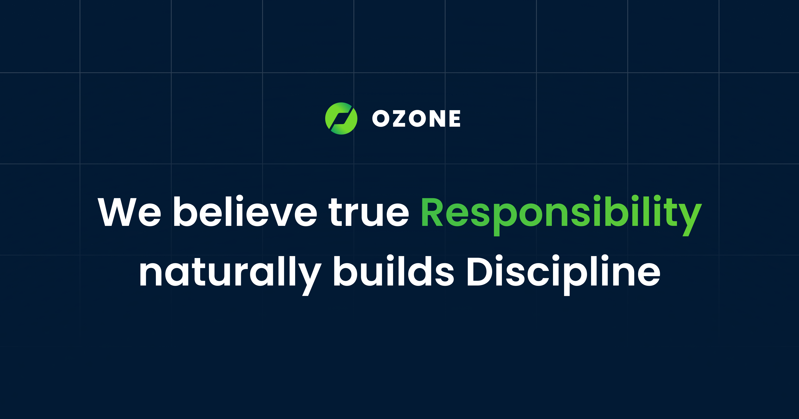

# Ozone Project

> Modular, scalable Next.js boilerplate for building production-ready applications for Ozone Digiverse. Remove .gitkeep later.



---

## ✨ Features

- ⚡ Next.js App Router (App Directory)
- 🧱 Modular architecture (feature-based)
- 🎨 Atomic UI components
- 🔐 Auth-ready structure
- 📦 Scalable folder structure
- 🧩 Typed with TypeScript
- 🎯 Production-ready setup

---

## 📁 Project Structure

### Base setup for this project, use what you need.

```bash
.
├── app/                        # App Router (routes, layouts)
│   ├── (auth)/
│   │   ├── login/
│   │   └── register/
│   ├── (dashboard)/
│   │   ├── page.tsx
│   │   └── layout.tsx
│   ├── api/
│   │   └── auth/route.ts
│   ├── layout.tsx
│   ├── page.tsx
│   └── globals.css
│
├── components/
│   ├── ui/                     # Atomic UI (Button, Input, Modal)
│   │   ├── button.tsx
│   │   ├── input.tsx
│   │   └── badge.tsx
│   │
│   ├── layout/                 # Layout building blocks
│   │   ├── navbar.tsx
│   │   ├── sidebar.tsx
│   │   └── footer.tsx
│   │
│   ├── features/               # Feature-level components
│   │   ├── auth/
│   │   ├── dashboard/
│   │   └── billing/
│   │
│   └── shared/                 # Generic UI pieces
│       ├── empty-state.tsx
│       ├── loader.tsx
│       └── error-boundary.tsx
│
├── hooks/                      # Custom React hooks
│   ├── useDebounce.ts
│   ├── useMediaQuery.ts
│   ├── useScrollPosition.ts
│   └── useMounted.ts
│
├── lib/                        # Core logic & helpers
│   ├── api/                    # API clients
│   │   ├── client.ts
│   │   ├── auth.ts
│   │   └── user.ts
│   ├── utils/                  # Small helper functions
│   │   ├── cn.ts
│   │   ├── format.ts
│   │   └── debounce.ts
│   ├── config/                 # App-level config
│   │   ├── site.ts
│   │   ├── routes.ts
│   │   └── env.ts
│   └── validators/             # Zod schemas
│       ├── auth.schema.ts
│       └── user.schema.ts
│
├── data/                       # Static JSON / mock data
│   ├── navigation.json
│   ├── pricing.json
│   └── faqs.json
│
├── services/                   # Business logic layer
│   ├── auth.service.ts
│   ├── user.service.ts
│   └── billing.service.ts
│
├── store/                      # Zustand / Redux
│   ├── useAuthStore.ts
│   ├── useUIStore.ts
│   └── index.ts
│
├── types/                      # Global TS types
│   ├── user.ts
│   ├── api.ts
│   └── index.ts
│
│
├── middleware.ts
├── next.config.js
├── tsconfig.json
├── tailwind.config.ts
└── package.json
```

### Exclusive for handle the assets

```bash
public/
├── assets/
│   ├── global/                     # Shared across entire app
│   │   ├── logo/
│   │   │   ├── logo.svg
│   │   │   ├── logo-dark.svg
│   │   │   └── favicon.ico
│   │   ├── icons/
│   │   └── patterns/
│   │
│   ├── landing/                    # Landing page only
│   │   ├── hero/
│   │   │   ├── hero-main.png
│   │   │   ├── hero-bg.webp
│   │   │   └── hero-illustration.svg
│   │   ├── sections/
│   │   │   ├── features/
│   │   │   ├── testimonials/
│   │   │   └── pricing/
│   │   └── mockups/
│   │       ├── dashboard.png
│   │       └── mobile.png
│   │
│   ├── dashboard/                  # Authenticated app (panel)
│   │   ├── avatars/
│   │   ├── empty-states/
│   │   ├── charts/
│   │   └── illustrations/
│   │
│   ├── marketing/                  # Ads, campaigns, banners
│   │   ├── facebook/
│   │   ├── twitter/
│   │   └── google/
│   │
│   ├── onboarding/
│   │   ├── steps/
│   │   └── tooltips/
│   │
│   └── misc/
│       ├── placeholders/
│       └── thumbnails/
```
### Handle for custom react-icons

```bash
components/
└── icons/
    ├── dashboard.tsx
    ├── user.tsx
    ├── settings.tsx
    └── index.ts